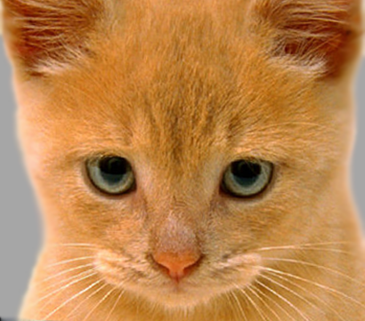

# **To run the script:**
`python3 fourier_transform_and_hybrid_images.py images_for_hybrid/cat.jpg images_for_hybrid/dog.jpg`

`python3 fourier_transform_and_hybrid_images.py images_for_hybrid/car.jpg images_for_hybrid/rhino.jpg`

`python3 fourier_transform_and_hybrid_images.py images_for_hybrid/marilyn.jpg images_for_hybrid/einstein.jpg`

# Example

  
  
  

  
  
  

  
  
  

# Guide

Note, given you're familiarity with Sobel filters, I anticipate that implementing Sobel hybrid images (parts 1-4) shouldn't take you too long.  The Fourier hybrid implementation and experimentation on various parameter values may well take a while though.

1) You may wish to start with fft_imshow.py   Download fft_imshow.py , but regardless, start your python program by implementing the following:
- create/change file the python file to use the name:  hybrid_images.py
- modify the function for getting arguments to receive the filenames of two images from the command line;  this function should ensure that both files exist
- have the program then show the two images
2) With most of the filtering we've seen to date, it's been sufficient to perform filtering upon the 8-bit data type used by each color for each pixel.  However, the 0 -> 255 scale is not very convenient when you begin applying techniques upon pixels like multiplication, division, large adds, square root, merging (weighted average), or especially things that require real numbers, like the Fourier transform.  So, the real number domain of [0.0, 1.0) is much more convenient in these cases.  Therefore, we need to convert our images to their floating-point representation, which is cv2.CV_32F or cv2.CV_64F in OpenCV (vs. the default of cv2.CV_8U):

- In Python's version of OpenCV, the pixel data in images are represented as numpy arrays.  So converting from the default integer representation (cv2.CV_8U, or uint8 in numpy parlance), we need to use numpy's methods for data type conversion:  np.uint8() and np.float32().  However, we also need to consider range...
- The default image representation in OpenCV is 8-bit unsigned, with pixel values ranging between 0 and 255 (per channel).  In contrast, the floating-point representation (cv2.CV_32F, or float32 in numpy terminology) represents pixel values in the range [0.0, 1.0).  Since both the data type and range are different, when converting between types, we also need to change the range/scale.
- Create two functions, convertToFloat32() and convertToInt8(), that appropriately convert images to 32-bit float and 8-bit integer, respectively.  NOTE:  each of these functions should return a 32-bit float or 8-bit float, respectively, regardless of whether the input image was already in the desired format.  So, you should check the image.dtype variable before converting the image scale and type to the desired output type...
3) For implementing the Sobel version for Hybrid Images, we first need to compute the edge magnitude results from the Sobel filters.  To do this, let's use the square-root of the sum of the squares method -- i.e. the tougher but more accurate version:

- using your functions from part 2), first convert the second image (from the command line) to a 32-bit float image
- then create a function, getSobelEdgesFloat32(), that:
  - computes the Sobel gradient in the x-direction (i.e. vertical edges),
  - computes the Sobel gradient in the y-direction (i.e. horizontal edges),
  - squares each of these gradient images
  - then adds them together, and
  - takes the square root (i.e. generate the square root of the sum of the squares)
  - the function should return the 32-bit float image
4) Create the Sobel version for making hybrid images:

- Create a function, getSobelHybrid(), which receives two input images, and generates a hybrid output image.  This function should:
  - For the first of the two images specified on the command line, apply Gaussian blurring to create a significantly blurred image (preferably in color).  This blurred image corresponds to the right-most image in the hybrid image examples.
  - For the second image, use the getSobelEdgesFloat32() function that you just created, generate the edge magnitude image for the second image to extract its high-frequency information.
    - first convert the image to grayscale,
    - then apply a Gaussian filter, to perform a little pre-smoothing before applying the the Sobel filters
    - then use getSobelEdgesFloat32()

- Last, we need to combine the blurred image with the edge image.  Combining the two is tricky if we want to make it look reasonably good in color.  While a simple solution is to average, via:  result = blurred / 2 + edges / 2, this is complicated by a couple of issues:

  - First, we computed the edges in grayscale, so you need to convert that to a color image.
  - Second, are the images using the same data type?  If not, convert appropriately...
  - Once you've got the 3-channel versions of both images, as opposed to combining them half-and-half as proposed above, there's a better way using one of the OpenCV methods listed above...  Note:  multiplication does NOT work well.
- The Gaussian and Sobel filters applied to the second image allow some parameterization, so this function should have some input arguments to pass values of some of those parameters.  Experiment with various parameterizations to determine some values effective for the provided images, and then use these as the default values for those arguments.
- Once completed, return the result and have the main program display the result

5) Create the Fourier Transform version for making hybrid images:
- Create a function, getFourierHybrid(), which receives two input images, and generates a hybrid output image.  This function should:
  - The process for making hybrid images using the Fourier Transform is similar to that for Sobel, however, you use the Fourier Transform for filtering BOTH input images, applying a low-pass filter to create a blurred version of the first image, and a high-pass or band-pass filter to create the details (high-frequency) image for the second image.
  - The Fourier Transform example code, fft_imshow.py   Download fft_imshow.py , shows the process for converting an image to the frequency domain, applying a masking filter, and then converting back to the spatial domain.  We will do this for each of the images, but use different masks for each.
  - Create a python function, createMask(), that creates a mask filter that we can apply for Fourier filtering.  This function should:
    - return a mask that is of the same size as the original image
    - enable creation of a low-pass, band-pass, or high-pass filter utilizing two frequency cutoffs
      - the frequency cutoffs are passed as values between 0.0 and 1.0, where 0 is 0% distance from center, and 1.0 is 100% distance from center;  values most commonly in range 0.1-0.5)
    - pass in four input arguments:
      - filter type  (0 = low-pass, 1 = high-pass, 2 = band-pass)
      - first frequency cutoff  (given as a value in range 0.0 to 1.0)
      - second frequency cutoff        # only used for band-pass filter
      - shape   (0 = circle, 1 = rectangle)
- Using createMask(), create a low-pass filter mask for the first image.
- Using createMask(), create a high-pass filter mask for the second image.
- Once the masks are available, apply filters (in similar fashion as fft_imshow.py)   Download fft_imshow.py) :
    - separate the first image into three channels
    - convert the second image to gray-scale
    - convert each image channel to frequency domain
    - apply its mask,
    - convert back to spatial domain
    - combine channels into two 3-channel images
- Finally, merge the two images into a hybrid image, in similar fashion to that used for Sobel hybrid images.
- As with the Sobel hybrid image case, various parameterizations are available, though for Fourier Transform, that's based on the type of filter and the frequency cutoff settings.  Try a few different frequency cutoffs for the low-pass filter on the first image, the high-pass filter on the second image, and also try a few bandpass filters on the second image.
- Once completed, return the result and have the main program display the result
